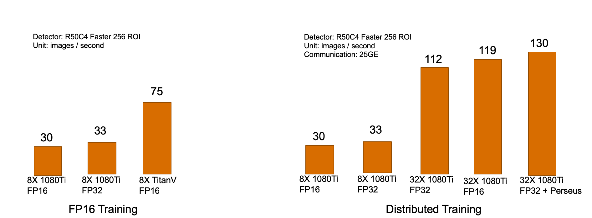

## SimpleDet - A Simple and Versatile Framework for Object Detection and Instance Recognition
### Major Features

- FP16 training for memory saving and up to **2.5X** acceleration
- Highly scalable distributed training available **out of box**
- Full coverage of state-of-the-art models including FasterRCNN, MaskRCNN, CascadeRCNN, RetinaNet and **TridentNet**
- Extensive feature set including **large batch BN**, deformable convolution, soft NMS, multi-scale train/test
- Modular design for coding-free exploration of new experiment settings


### Setup
#### Install
SimpleDet contains a lot of C++ operators not in MXNet offical repo, so one has to build MXNet from scratch. Please refer to [INSTALL.md](./doc/INSTALL.md) more details

#### Preparing Data
SimpleDet requires groundtruth annotation organized as following format
```
[
    {
        "gt_class": (nBox, ),
        "gt_bbox": (nBox, 4),
        "flipped": bool,
        "h": int,
        "w": int,
        "image_url": str,
        "im_id": int,

        # this fields are generated on the fly during test
        "rec_id": int,
        "resize_h": int,
        "resize_w": int,
        ...
    },
    ...
]
```

Especially, for experimenting on coco datatet, one can organize coco data in
```
data/
    coco/
        annotations/
            instances_train2014.json
            instances_valminusminival2014.json
            instances_minival2014.json
            image_info_test-dev2017.json
        images/
            train2014
            val2014
            test2017
```

and run the helper script to generate roidb
```bash
python3 utils/generate_roidb.py --dataset coco --dataset-split train2014
python3 utils/generate_roidb.py --dataset coco --dataset-split valminusminival2014
python3 utils/generate_roidb.py --dataset coco --dataset-split minival2014
python3 utils/generate_roidb.py --dataset coco --dataset-split test-dev2017
```

#### Deploy dependency and compile extension
1. setup mxnext, a wrapper of mxnet symbolic API
```bash
git clone https://github.com/RogerChern/mxnext
```
2. run make in simpledet directory to install cython extensions

#### Quick Start

```bash
# train
python3 detection_train.py --config config/detection_config.py

# test
python3 detection_test.py --config config/detection_config.py
```


### Project Design
#### Model Zoo
Please refer to [MODEL_ZOO.md](./MODEL_ZOO.md) for available models

#### Code Structure
```
detection_train.py
detection_test.py
config/
    detection_config.py
core/
    detection_input.py
    detection_metric.py
    detection_module.py
models/
    FPN/
    tridentnet/
    maskrcnn/
    cascade_rcnn/
    retinanet/
mxnext/
symbol/
    builder.py
```
#### Config
Everything is configurable from the config file, all the changes should be **out of source**.

#### Experiments
One experiment is a directory in **experiments** folder with the same name as the config file.
> E.g. r50_fixbn_1x.py is the name of a config file

```
config/
    r50_fixbn_1x.py
experiments/
    r50_fixbn_1x/
        checkpoint.params
        log.txt
        coco_minival2014_result.json
```

#### Models
The `models` directory contains SOTA models implemented in SimpletDet.

#### How is Faster-RCNN built
**Simpledet** supports many popular detection methods and here we take [**Faster-RCNN**](https://arxiv.org/abs/1506.01497) as a typical example to show how a detector is built.

- *Preprocessing*. The preprocessing methods of the detector is implemented through `DetectionAugmentation`.
  - Image/bbox-related preprocessing, such as `Norm2DImage` and `Resize2DImageBbox`.
  - Anchor generator `AnchorTarget2D`, which generates anchors and corresponding anchor targets for training RPN.
- *Network Structure*. The training and testing symbols of Faster-RCNN detector is defined in `FasterRcnn`. The key components are listed as follow:
  - *Backbone*. `Backbone` provides interfaces to build backbone networks, *e.g.* ResNet and ResNext.
  - *Neck*. `Neck` provides interfaces to build complementary feature extraction layers for backbone networks, *e.g.* `FPNConvTopDown` builds Top-down pathway for [Feature Pyramid Network](https://arxiv.org/abs/1612.03144).
  - *RPN head*. `RpnHead` aims to build classification and regression layers to generate proposal outputs for RPN. Meanwhile, it also provides interplace to generate sampled proposals for the subsequent R-CNN.
  - *Roi Extractor*. `RoiExtractor` extracts features for each roi (proposal) based on the R-CNN features generated by `Backbone` and `Neck`.
  - *Bounding Box Head*. `BboxHead` builds the R-CNN layers for proposal refinement.

#### How to build a custom detector
The flexibility of **simpledet** framework makes it easy to build different detectors. We take [**TridentNet**](https://arxiv.org/abs/1901.01892) as an example to demonstrate how to build a custom detector simply based on the **Faster-RCNN** framework.

- *Preprocessing*. The additional processing methods could be provided accordingly by inheriting from `DetectionAugmentation`.
  - In TridentNet, a new `TridentAnchorTarget2D` is implemented to generate anchors for multiple branches and filter anchors for scale-aware training scheme.
- *Network Structure*. The new network structure could be constructed easily for a custom detector by modifying some required components as needed and 
  - For TridentNet, we build trident blocks in the `Backbone` according to the descriptions in the paper. We also provide a `TridentRpnHead` to generate filtered proposals in RPN to implement the scale-aware scheme. Other components are shared the same with original Faster-RCNN.


### Distributed Training
Please refer to [DISTRIBUTED.md](./doc/DISTRIBUTED.md)


### Contributors
Yuntao Chen, Chenxia Han, Yanghao Li, Zehao Huang, Yi Jiang, Naiyan Wang


### License
This project is release under the Apache 2.0 license for non-commercial usage. For commercial usage, please contact us for another license.
