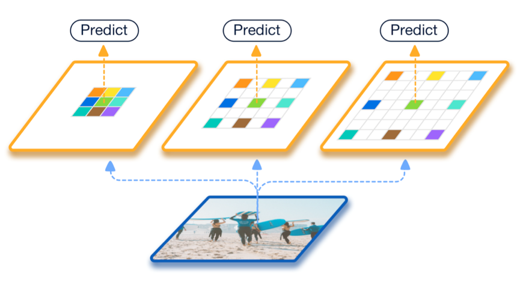
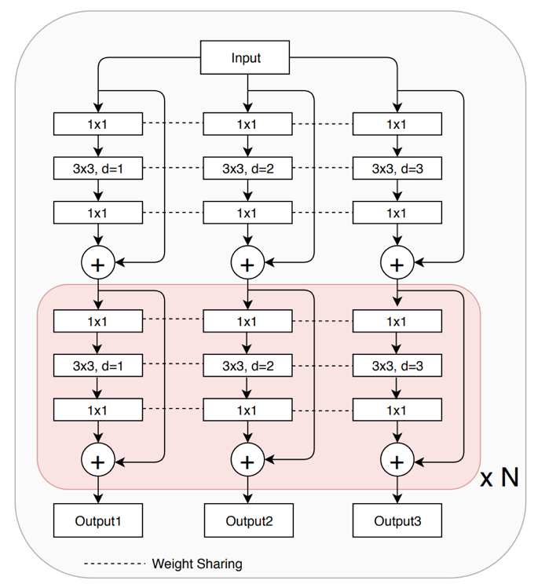

## Scale-Aware Trident Networks for Object Detection

Yanghao Li\*, Yuntao Chen\*, Naiyan Wang, Zhaoxiang Zhang

<p align="center">  </p>

### Introduction

This repository implements [TridentNet](https://arxiv.org/abs/1901.01892) in the SimpleDet framework. 

Trident Network (TridentNet) aims to generate scale-specific feature maps with a uniform representational power. We construct a parallel multi-branch architecture in which each branch shares the same transformation parameters but with different receptive fields. Then, we propose a scale-aware training scheme to specialize each branch by sampling object instances of proper scales for training. As a bonus, a fast approximation version of TridentNet could achieve significant improvements without any additional parameters and computational cost. On the COCO dataset, our TridentNet with ResNet-101 backbone achieves state-of-the-art single-model results by obtaining an mAP of 48.4.

#### Trident Blocks

- Dilated convolution for efficient scale enumeration
- Weight sharing between convs for uniform representation

<p align="center">  </p>

The above figure shows how to convert bottleneck residual blocks to 3-branch Trident Blocks. The dilation rate of three branches are set as 1, 2 and 3, respectively.

### Use TridentNet

Please setup SimpleDet following [README](../../README.md)  and use the TridentNet configuration files in the `config` folder.

### Results on MS-COCO

|                             | Backbone   | Test data | mAP@[0.5:0.95] | Link |
| --------------------------- | ---------- | --------- | :------------: | -----|
| Faster R-CNN, 1x            | ResNet-101 | minival   |      37.6      |[model](https://simpledet-model.oss-cn-beijing.aliyuncs.com/faster_r101v2c4_c5_256roi_1x.zip)|
| TridentNet, 1x              | ResNet-101 | minival   |      40.6      |[model](https://simpledet-model.oss-cn-beijing.aliyuncs.com/tridentnet_r101v2c4_c5_1x.zip)|
| TridentNet, 1x, Fast Approx | ResNet-101 | minival   |      39.9      |[model](https://simpledet-model.oss-cn-beijing.aliyuncs.com/tridentnet_r101v2c4_c5_fastapprox_1x.zip)|
| TridentNet, 2x              | ResNet-101 | test-dev  |      42.8      |[model](https://simpledet-model.oss-cn-beijing.aliyuncs.com/tridentnet_r101v2c4_c5_addminival_2x.zip)|
| TridentNet*, 3x             | ResNet-101 | test-dev  |      48.4      |[model](https://simpledet-model.oss-cn-beijing.aliyuncs.com/tridentnet_r101v2c4_c5_multiscale_addminival_3x_fp16.zip)|

Note: to test TridentNet*, please import `resnet_v2_for_paper` other than `resnet_v2` in `tridentnet/builder.py` due to a slight difference in the position of a FP16 cast operator.

### Citing TridentNet

```
@article{li2019scale,
  title={Scale-Aware Trident Networks for Object Detection},
  author={Li, Yanghao and Chen, Yuntao and Wang, Naiyan and Zhang, Zhaoxiang},
  journal={arXiv preprint arXiv:1901.01892},
  year={2019}
}
```
