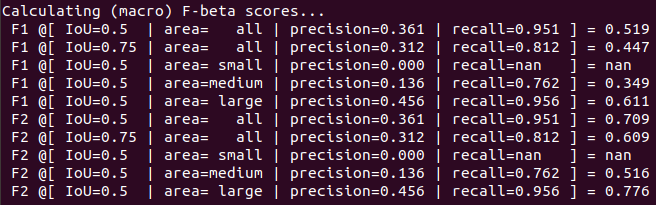
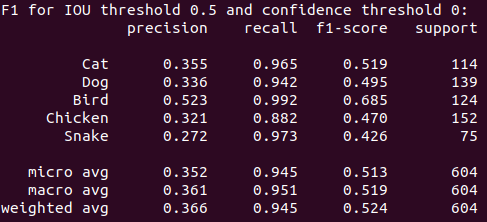
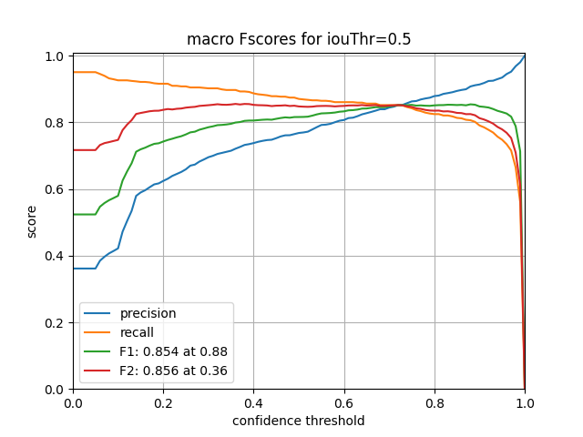
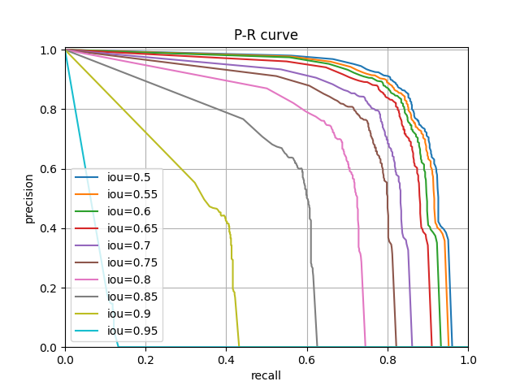

# F-Beta Better Than COCO API

This repo is a drop-in replacement for [cocoapi](https://github.com/cocodataset/cocoapi) to calculate F-beta scores for object detection tasks.

## Installation

```
cd PythonAPI && make
```

OR

```
pip3 install 'git+https://github.com/yhsmiley/cocoapi.git#subdirectory=PythonAPI'
```

## Usage

### Initialize the api:
```
from pycocotools.coco import COCO
from pycocotools.cocoeval import COCOeval
cocoGt = COCO(true_path)  # initialize COCO ground truth api
cocoDt = cocoGt.loadRes(pred_path)  # initialize COCO prediction api
cocoEval = COCOeval(cocoGt, cocoDt, 'bbox')  # initialize COCO evaluation api
cocoEval.evaluate()
```

### To get F-beta scores of detections:
```
cocoEval.accumulateFBeta()
```

```
cocoEval.summarizeFBetaScores(average='macro')
```


```
cocoEval.printReport(beta=1, iouThr=0.5)
```


```
cocoEval.plotFBetaCurve(filename, betas=[1,2], iouThr=0.5, average='macro')
```


```
cocoEval.plotPRCurve(filename, average='macro')
```


Edge cases:
- no ground truths, and no detections for the class: TP=FP=FN=0 -> precision, recall, F1 = 1
- ground truth exists, but no detections for the class: TP=FP=0, FN>0 -> precision = 1

### For original COCO-style evaluation:
```
cocoEval.accumulate()
cocoEval.summarize()
mapAll, map50 = cocoEval.stats[:2]

cocoEval.plotCocoPRCurve(filename, classIdx=None)
```
