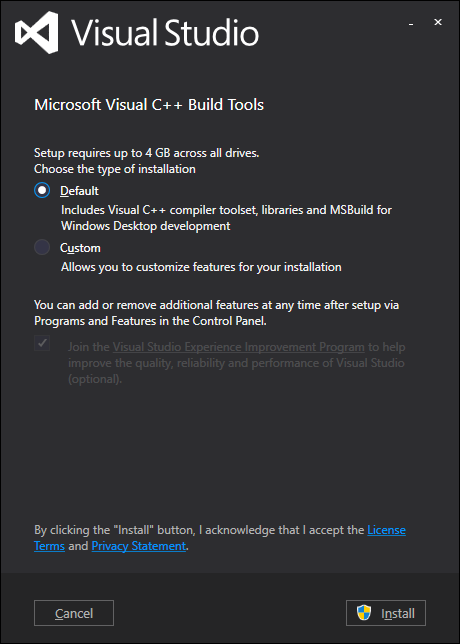
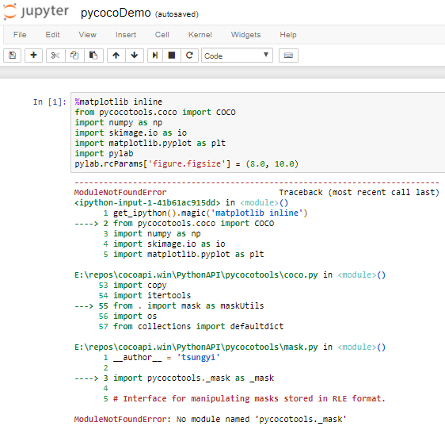

Clone of COCO API - http://cocodataset.org/
===========================================

# Original README:

COCO is a large image dataset designed for object detection, segmentation, person keypoints detection, stuff segmentation, and caption generation. This package provides Matlab, Python, and Lua APIs that assists in loading, parsing, and visualizing the annotations in COCO. Please visit http://cocodataset.org/ for more information on COCO, including for the data, paper, and tutorials. The exact format of the annotations is also described on the COCO website. The Matlab and Python APIs are complete, the Lua API provides only basic functionality.

In addition to this API, please download both the COCO images and annotations in order to run the demos and use the API. Both are available on the project website.

Please download, unzip, and place the images in: coco/images/

Please download and place the annotations in: coco/annotations/

For substantially more details on the API please see http://cocodataset.org/#download.

# This clone's README:

To support Windows build and python3 we had to make [minor changes](https://github.com/cocodataset/cocoapi/compare/master...philferriere:master#diff-49ecc5c8e93163121e2cc2eb6b1fca2c) to:

- `PythonAPI/setup.py`
- `PythonAPI/pycocotools/coco.py`

To install this package, use `pip` as follows:

```
(dlwin36coco) Phil@SERVERP E:\repos
$ pip install git+https://github.com/philferriere/cocoapi.git#subdirectory=PythonAPI
Collecting git+https://github.com/philferriere/cocoapi.git#subdirectory=PythonAPI
  Cloning https://github.com/philferriere/cocoapi.git to c:\users\phil\appdata\local\temp\pip-req-build-jn698z8p
Building wheels for collected packages: pycocotools
  Running setup.py bdist_wheel for pycocotools ... done
  Stored in directory: C:\Users\Phil\AppData\Local\Temp\pip-ephem-wheel-cache-rde3oevt\wheels\69\2b\12\2fa959e49f73d26cff202c2f4e5079096c9c57c8a8509fd75c
Successfully built pycocotools
Installing collected packages: pycocotools
Successfully installed pycocotools-2.0
```

On Windows, you must have the Visual C++ 2015 build tools on your path. If you don't, make sure to install them from [here](https://go.microsoft.com/fwlink/?LinkId=691126):


Then, run `visualcppbuildtools_full.exe` and select default options:



# Why have the demo notebooks been moved into their own directory?

If you clone/fork the **original** repo, you may hit the following error when running the demo notebooks:



It happens because there is a `pycocotools` directory in the same folder as the notebooks. The python code being imported then is the **local** implementation of `pycocotools`, not the one installed with `pip`. To fix this issue, the demo notebooks have been moved to their own directory.

# why am I getting a `ModuleNotFoundError: No module named 'pycocotools._mask'` error in my code?

If you get this error, it is because the COCO library you are calling is **NOT** our version of the library. Instead, you are (inadvertently) referencing **a local copy** of the library. So, if you get this error, search the tree of import in your code for a reference to a local `pycocotools` library. Then, move or delete the local version.


